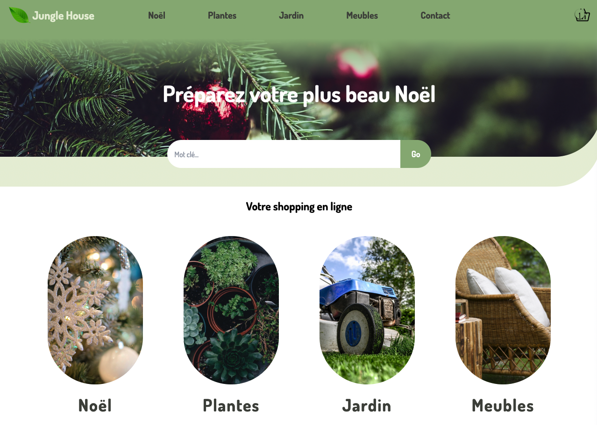
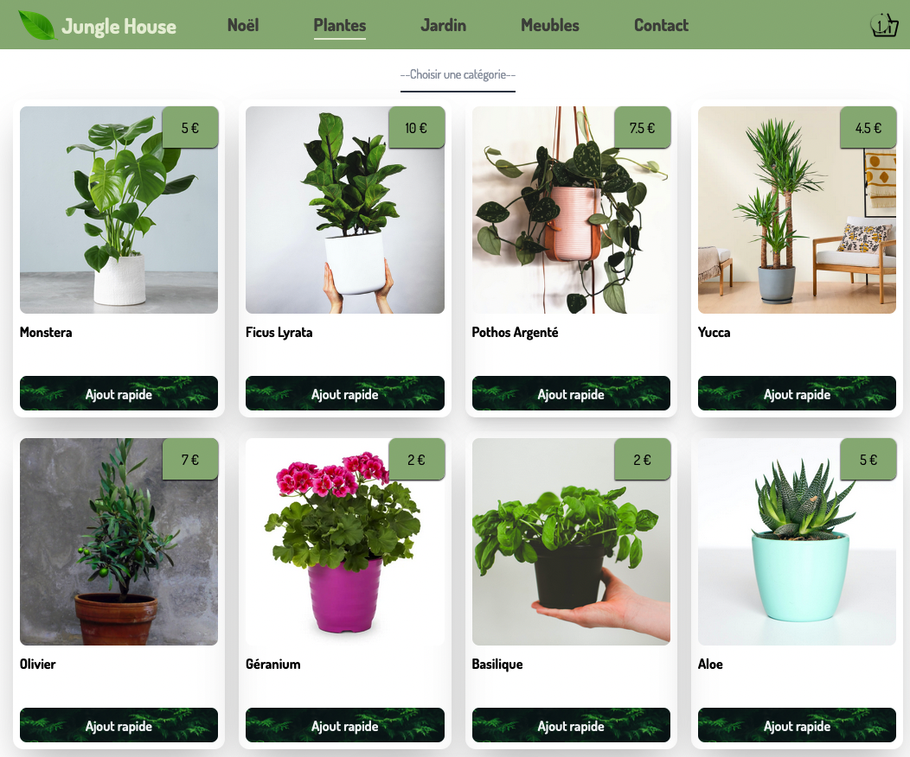
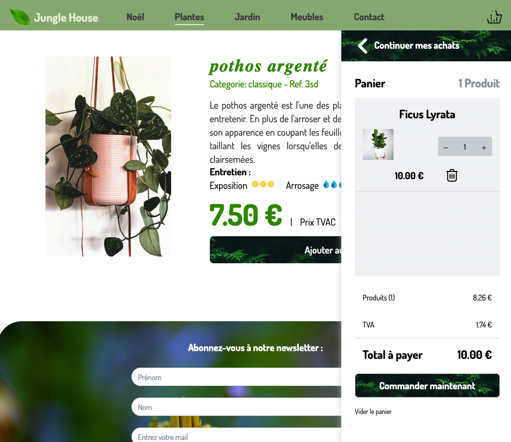

## Welcome to my Jungle Shop Boutique Project!

# Jungle House
## Link to the actual site
[Jungle house](https://junglehouse-project.netlify.app/)

## Description
It's a Online shop that sells plants, garden garnitures, Christmas ornaments and gardening accessories & tools.
It's possible to add items to the cart, modify the cart and empty the cart.

The project was realized to learn React and practice Tailwind. This is my first React project.
I learned react on my own during a 7-month Bootcamp.

/!\ Fot the moment only the plant section is complete. 

### What's to improve?
Reponsive design need to be improve at some points. 
The other sections need to be finished.

The backend still need to be done.

### Overview of the project 

